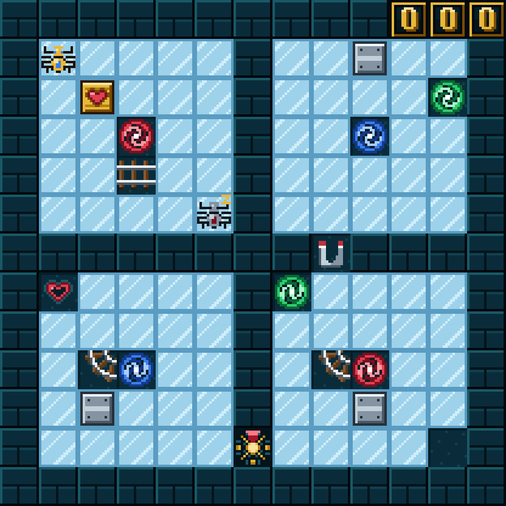

# El Corazón Helado

Un puzzle de hielo, portales e imanes para dos arañas y un cofre con un corazón de rubí.
Juego web autónomo en **PuzzleScript Next**, con pixel-art 16-bit propio y tarjetas ilustradas con todas las reglas.

**▶ Jugar:** https://spyder-cripto.github.io/el-corazon-helado/

## Cómo se juega
- **Objetivo:** lleva el cofre del corazón hasta la meta con forma de corazón.
- **Flechas:** mover · **X** o **clic** en la araña dormida: cambiar de araña · **Z:** deshacer · **R:** reiniciar.
- **En el móvil:** desliza el dedo para moverte y toca la pantalla para cambiar de araña; deshacer y reiniciar están en la pestaña del borde izquierdo.
- Dentro del juego, el botón **«Cómo se juega»** abre las tarjetas con las reglas y las piezas.

## Piezas
Hielo que desliza · portales por parejas (rojo, verde y azul) · vías que solo dejan entrar y salir cajas por sus extremos ·
imán que clava cajas · sol interruptor que gira los imanes · cajas de plata para hacer de tope · contador de pasos.

**Récord conocido: 89 pasos.** ¿Te atreves?

## Créditos
- Recreación, arte 16-bit y tarjetas: **Spider** (Fali + Claude), 2026
- Nivel original: filou (sokobanonline.com, 2016)
- Motor: [PuzzleScript Next](https://github.com/david-pfx/PuzzleScriptNext) (derivado de PuzzleScript de increpare), incrustado en un único `index.html`
- Fuente del juego: [`juego.txt`](juego.txt)
